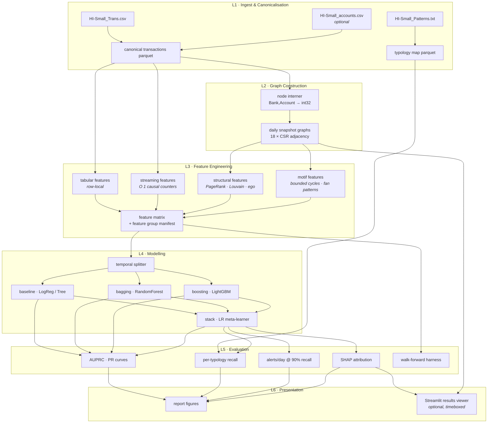
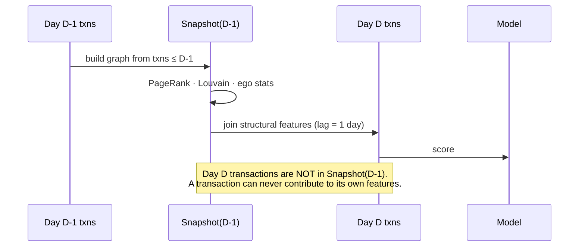
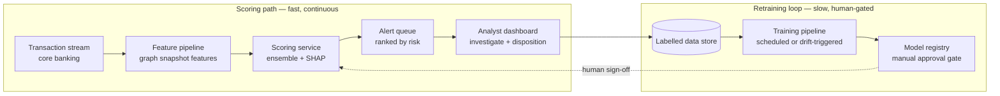

# Architecture — Graph-Feature AML Detection

**Project:** Anti-money-laundering transaction monitoring on the IBM AML `HI-Small` dataset
**Track:** Datathon (time-boxed analysis project, not a product)
**Status:** Design document. This describes *structure, contracts and data flow only* — it deliberately contains no implementation code, per the working agreement in [project_info.md](project_info.md).

---

## 0. How to read this document

This is the blueprint the build follows. It is organised as:

| Section | What it fixes |
|---|---|
| [1](#1-design-thesis) | The one-sentence thesis every component must serve |
| [2](#2-ground-truth-measured-dataset-facts) | **Measured** dataset facts — several override assumptions in the brief |
| [3](#3-system-architecture) | Layer diagram and the pipeline DAG |
| [4](#4-repository-layout) | Files and directories |
| [5](#5-layer-1--ingest--canonicalisation) – [10](#10-layer-6--presentation) | Per-layer component specs, contracts, artifacts |
| [11](#11-temporal-integrity-architecture) | The leakage architecture — the methodological differentiator |
| [12](#12-experiment-matrix) | What we actually run, and what each run proves |
| [13](#13-configuration--reproducibility) | Seeds, config, determinism |
| [14](#14-production-architecture-documentation-only) | Systems-thinking section — **not built** |
| [15](#15-risk-register) – [17](#17-scope-guardrails) | Risks, build order, scope discipline |

Function signatures appear as **contracts** (name, inputs, outputs, invariants). Bodies are written later, one step at a time.

---

## 1. Design thesis

> A single transaction rarely looks illicit. A *subgraph* of transactions often does.

Everything in this architecture exists to test that claim and to make the test **credible**:

1. **Build graph-derived features** that encode fan-out, fan-in, cycles, layering and community structure.
2. **Compute them causally** so no future information leaks into past feature rows.
3. **Prove the lift with an ablation** (tabular-only vs. tabular+graph) rather than asserting it.
4. **Evaluate the way a compliance team would** — alerts/day at fixed recall, per-typology recall — not with accuracy.

Three architectural consequences follow, and they drive every decision below:

- The **feature layer is the product**, not the model layer. Model progression is a controlled comparison, not a search for the best number.
- The **temporal contract** (§11) is a first-class subsystem, not a `train_test_split` argument.
- Every artifact is **on disk, versioned by config hash, and reproducible from a seed** — because "we can regenerate this" is what makes the ablation believable.

---

## 2. Ground truth: measured dataset facts

These were measured directly from the files in this repo, not taken from the dataset card. **Four of them change the design** and are marked ⚠️.

| Property | Value |
|---|---|
| Transaction rows | **5,078,345** |
| Illicit rows (`Is Laundering = 1`) | **5,177** — **0.102 %** |
| Time span | **2022-09-01 00:00 → 2022-09-18 16:18** (18 calendar days, minute resolution) |
| **Usable modelling window** | **days 0–9 only** ⚠️ — 5,077,237 rows (99.98 %), 4,522 illicit |
| **Generator tail** | **days 10–17** ⚠️ — 1,108 rows (0.02 %) at a **59.1 % illicit rate**, 664× the main window |
| Attempt duration | **305 of 370 attempts span >1 day**, up to **8 days** ⚠️ |
| Max out / in **transaction count** | **168,672** / 1,084 — one dominant hub, **3.8 %** of non-self-loop rows |
| Max out / in **degree** (distinct counterparties) | **14,230** / 545 ⚠️ *(corrected in Phase 2 — see §2.1)* |
| Non-self-loop rows → **collapsed edges** | 4,487,133 → **647,939** ⚠️ (6.9× collapse) |
| Distinct `(Bank, Account)` node keys | **515,088** |
| Distinct `Account` strings alone | **515,080** ⚠️ (8 collisions — account numbers are *not* globally unique) |
| Banks | 30,528 |
| Self-loop rows (sender == receiver) | **591,212 — 11.6 %**, of which only 11 illicit ⚠️ |
| Payment formats | Cheque 1.86 M, Credit Card 1.32 M, ACH 601 K, Cash 491 K, Reinvestment 481 K, Wire 172 K, Bitcoin 146 K |
| Currencies | 15+ (USD 1.88 M, EUR 1.17 M, CHF, CNY, ILS, INR, GBP, RUB, JPY, BTC, …) |
| Laundering attempts in `Patterns.txt` | **370 blocks**, covering **3,209 transaction rows** ⚠️ |
| Typology families | FAN-OUT, FAN-IN, CYCLE, SCATTER-GATHER, GATHER-SCATTER, BIPARTITE, STACK, RANDOM |

### 2.1 What these facts force

**⚠️ The span is 18 calendar days but only 10 usable days.** *(measured in Phase 1; this replaced the original plan)*

Activity is not spread across the 18 days. Days 0–9 carry 99.98 % of the rows; days 10–17 carry 1,108 rows — and run a **59.1 % illicit rate against 0.089 % in the main window**. That is not a trend, it is a generator artifact: the IBM simulator flushes its remaining laundering patterns at the end of the run without the background licit traffic that accompanies them earlier.

The originally configured split (train 0–10, val 11–12, test 13–17) would have put **247 rows in the test set at a 58 % positive rate**. Every headline metric would have been unstable *and* wildly optimistic. Therefore:

- Modelling is truncated at **`max_day = 9`**. Days 10–17 are excluded and disclosed in Limitations, not quietly included.
- Snapshot granularity is **daily → 10 snapshots**. Weekly would give one.
- Split is re-cut inside the usable window: **train 0–5 / val 6 / test 7–9** → 3,248,921 / 482,751 / 1,345,565 rows and 2,530 / 497 / 1,495 positives.
- Lookback is a config knob over `{3d, 7d, ∞ (cumulative)}`. `∞` over 10 days is *not* "leaky" — it is still strictly causal, it just has no recency decay. We report the knob's effect rather than asserting a number.
- Walk-forward uses **5 blocks × 2 days** (4 evaluation points).

**⚠️ Laundering attempts straddle every boundary.** *(measured in Phase 1)*

305 of 370 attempts span more than one day, the longest running 8 days inside a 10-day window. 96 attempts straddle the train|val boundary and 103 straddle val|test. The original §8.2 rule — assign a straddling attempt wholly to the earlier split — assumed straddling was rare; it would leave the test window with **59 annotated rows across 29 attempts**, destroying the per-typology exhibit (F3).

The design is therefore a **purged temporal split** (§8.2), which keeps 913 annotated test rows across 208 attempts at a cost of 535 training positives.

**⚠️ The hub figure was wrong, in both directions.** *(measured in Phase 2; this corrects what Phase 1 recorded)*

The original claim — "one node has out-degree 168,672, roughly a third of all non-self-loop
edges" — conflated two different quantities and overstated a third. Measured directly:

| | Recorded | Measured |
|---|---|---|
| Hub out-degree (distinct receivers) | 168,672 | **14,230** |
| Hub out **transactions** | — | **168,672** |
| Share of non-self-loop rows | "roughly a third" | **3.8 %** |
| Max in-degree | 1,084 | **545** (1,084 is the in-*transaction* count) |

Both quoted "degrees" were transaction counts. The distinction matters because the two
diverge by an order of magnitude precisely on the nodes we care about, so the backend now
keeps them apart explicitly: `degrees()` means distinct counterparties, `tx_counts()` means
transaction volume (§16, component 9).

**What actually follows:**

- **The motif branch cap is still load-bearing, for a smaller reason.** 14,230 distinct
  receivers still exceeds `cfg.motifs.max_branch = 200` by 71×, so the cap and the
  `motif_censored` flag (§7.4) still do real work — but the hub is not a third of the graph
  and will not swallow the motif search whole.
- **The hub is a high-throughput payer, not a structural monster.** 168,672 transactions
  across 14,230 counterparties is ~12 transactions each — payroll or merchant settlement.
  That is exactly the legitimate-but-laundering-shaped profile §9.6 predicts among top false
  positives, and it is now a concrete account to inspect rather than a hypothetical.
- **PageRank concentration is a much smaller worry** than "a third of all edges" implied.
  Percentile-rank reporting stays (it costs nothing) but is no longer a mitigation for an
  emergency.

**⚠️ The graph is 6.9× smaller than the row count suggests.** 4,487,133 non-self-loop rows
collapse to **647,939 distinct `(src, dst)` pairs** — the same account pairs transact
repeatedly. Every snapshot is therefore a sub-million-edge graph, not a multi-million-edge
one, which is the single largest reason the Phase 2 wall-clock came in far under budget
(§6.1). Parallel edges are not discarded: their count and summed amount become edge
attributes, so "these two accounts transacted 40 times" survives as a feature.

**⚠️ Account numbers are not globally unique.**
The canonical node key is the composite `(Bank, Account)`, interned to a contiguous `int32` node id. Using the bare account string would silently merge 8 distinct accounts and corrupt their degree/centrality. Cheap to get right; embarrassing to get wrong in a graph project.

**⚠️ 11.6 % of rows are self-loops** (mostly `Reinvestment`, an account paying itself).
Self-loops inflate degree, distort PageRank mass and pollute community detection, and carry essentially no laundering signal (11 of 591,212). They are therefore **excluded from graph edge construction** but **retained as tabular rows** to be scored, with `is_self_loop` as a tabular feature. This split — "the graph view and the scoring view are not the same row set" — is an explicit contract in §5.

**⚠️ Typology coverage is partial: 3,209 annotated of 5,177 illicit rows (62 %).**
Per-typology recall (§9.3) can only be reported over the annotated subset. The remaining 1,968 illicit rows form an explicit `UNANNOTATED` bucket. Reporting per-typology recall as if it covered all positives would be a quiet error; the coverage rate is stated in the report.

**Extreme imbalance (0.102 %) and positive clustering.**
5,177 positives are not independent — they cluster inside 370 attempts. Consequences: negative sub-sampling for *training* only (§8.3), and **grouped, temporal** evaluation — never a random split, which would scatter a single laundering ring across train and test.

---

## 3. System architecture

### 3.1 Layer view



### 3.2 Pipeline DAG

Each stage is an idempotent, cached, CLI-invokable step. Re-running a stage with unchanged config is a no-op (hash hit); changing config upstream invalidates everything downstream.

```
00_ingest      →  02_features   ─┐
   │               ↑             ├→ 03_train  →  04_evaluate  →  05_report
   └→ 01_graph  ───┘             │                    ↑
                                 └────────────────────┘
                                        (05_walkforward feeds 04)
```

| Stage | Reads | Writes | Wall-clock budget |
|---|---|---|---|
| `00_ingest` | raw CSV/TXT | `transactions.parquet`, `typology_map.parquet`, `node_index.parquet` | ~3 min |
| `01_graph` | canonical parquet | `snapshots/day=NN/{csr.npz, meta.json}` | ~10 min |
| `02_features` | parquet + snapshots | `features.parquet`, `feature_manifest.json` | ~25 min |
| `03_train` | features | `models/{name}/{model.pkl, oof.parquet}` | ~15 min |
| `04_evaluate` | models + typology map | `metrics/*.json`, `figures/*.png` | ~5 min |
| `05_report` | metrics + figures | `report/` assets | manual |

Budgets are targets that keep an end-to-end rebuild inside one hackathon evening. If a stage blows its budget, the escape hatch is `config.sampling.account_fraction` (§13.2), **not** silently weakening the temporal contract.

---

## 4. Repository layout

```
fraud-detection/
├── README.md                      # problem, dataset link, CDLA-Sharing-1.0 licence, Kaggle
│                                  #   download commands, setup, reproduction steps
├── architecture.md                # this document
├── requirements.txt               # pinned direct dependencies
├── pyproject.toml                 # makes `aml` importable via `pip install -e .`
├── .gitignore                     # excludes data/, artifacts/, venv/
│
├── config/
│   ├── default.yaml               # single source of truth: seeds, paths, windows, model params
│   └── experiments/
│       ├── ablation_tabular.yaml  # graph feature groups disabled
│       ├── ablation_graph.yaml    # all feature groups enabled
│       └── walkforward.yaml       # 6-block rolling-origin config
│
├── data/                          # GITIGNORED — never committed
│   ├── raw/                       # HI-Small_Trans.csv, HI-Small_Patterns.txt, HI-Small_accounts.csv
│   └── processed/                 # canonical parquet artifacts
│
├── artifacts/                     # GITIGNORED — regenerable outputs
│   ├── snapshots/                 # daily graph snapshots (CSR + metadata)
│   ├── features/
│   ├── models/
│   └── metrics/
│
├── src/aml/
│   ├── config.py                  # typed config loading, config-hash computation
│   ├── io.py                      # parquet read/write, artifact cache, hash-keyed paths
│   │
│   ├── ingest/
│   │   ├── transactions.py        # CSV → canonical schema, dtype/enum coercion
│   │   ├── patterns.py            # Patterns.txt block parser → typology map
│   │   └── accounts.py            # optional account reference join
│   │
│   ├── graph/
│   │   ├── interner.py            # (Bank, Account) → int32 node id, bidirectional
│   │   ├── backend.py             # GraphBackend protocol: igraph primary, networkx fallback
│   │   └── snapshots.py           # daily snapshot builder + lookback windowing
│   │
│   ├── features/
│   │   ├── base.py                # FeatureBlock protocol + registry + manifest emitter
│   │   ├── tabular.py             # row-local: amount, currency, format, time-of-day
│   │   ├── streaming.py           # O(1) causal counters: degree, volume, turnover latency
│   │   ├── structural.py          # PageRank, Louvain, ego-net stats (snapshot-based)
│   │   ├── motifs.py              # bounded-depth cycle / fan-in / fan-out detection
│   │   └── assemble.py            # join blocks → feature matrix, enforce causality assertions
│   │
│   ├── models/
│   │   ├── registry.py            # name → (estimator factory, hyperparams, feature groups)
│   │   ├── splits.py              # temporal split, walk-forward block generator
│   │   ├── sampling.py            # negative sub-sampling + weight correction
│   │   └── train.py               # fit / persist / out-of-fold prediction
│   │
│   ├── evaluate/
│   │   ├── metrics.py             # AUPRC, PR curve, recall@k, alerts-per-day
│   │   ├── typology.py            # per-typology recall breakdown
│   │   ├── explain.py             # SHAP on the tree ensemble
│   │   ├── walkforward.py         # rolling-origin harness + no-retrain control
│   │   └── figures.py             # all report plots, one function per exhibit
│   │
│   └── viz/
│       └── subgraph.py            # ego-subgraph extraction + layout for the demo
│
├── scripts/                       # thin CLI wrappers, one per DAG stage
│   ├── 00_ingest.py   01_graph.py   02_features.py
│   ├── 03_train.py    04_evaluate.py   05_walkforward.py
│
├── notebooks/
│   ├── 01_eda.ipynb               # schema verification, imbalance, typology coverage
│   ├── 02_graph_exploration.ipynb # degree distributions, sanity checks on snapshots
│   └── 03_results_narrative.ipynb # the walkthrough used for the demo video
│
├── app/
│   └── streamlit_app.py           # OPTIONAL results viewer over saved predictions
│
├── tests/                         # fast guards on the contracts, not exhaustive coverage
│   ├── test_config_io.py          # config hashing scope, atomic writes, cache reuse
│   ├── test_ingest.py             # schema + typology-join coverage assertions
│   ├── test_causality.py          # synthetic graph with a known future edge → A2 must fail
│   └── test_splits.py             # no attempt_id straddles a split boundary
│
└── report/
    └── report.md                  # Problem → Data → Methodology → Results → Limitations
```

**On tests:** this is a datathon, not a product, so coverage is not a goal. Tests exist only where a silent failure would invalidate a *result* — leakage, split boundaries, join coverage, cache staleness. Those four failures all produce a plausible-looking number rather than a crash, which is exactly why they need a guard.

**Design rule:** `src/aml/` holds all logic; `scripts/` and `notebooks/` only orchestrate and narrate. Nothing important is defined in a notebook — notebooks are for the story, modules are for the truth. This is what makes "reproduce our results" a real claim.

---

## 5. Layer 1 — Ingest & canonicalisation

### 5.1 Canonical transaction schema

The raw CSV has two columns literally named `Account` (sender and receiver). Canonicalisation resolves that and fixes dtypes once, so no downstream module ever parses a string.

| Column | Type | Notes |
|---|---|---|
| `tx_id` | `int64` | Row ordinal in the **timestamp-sorted** file. Stable primary key. |
| `timestamp` | `datetime64[s]` | Parsed from `YYYY/MM/DD HH:MM` |
| `day_idx` | `int16` | 0–17, days since 2022-09-01. The snapshot join key. |
| `src_bank` / `dst_bank` | `category` | |
| `src_acct` / `dst_acct` | `string` | |
| `src_node` / `dst_node` | `int32` | Interned `(bank, acct)` node id |
| `amount_paid` / `amount_received` | `float64` | |
| `currency_paid` / `currency_received` | `category` | |
| `payment_format` | `category` | 7 levels |
| `is_self_loop` | `bool` | `src_node == dst_node` |
| `is_cross_currency` | `bool` | `currency_paid != currency_received` |
| `is_cross_bank` | `bool` | `src_bank != dst_bank` |
| `label` | `int8` | `Is Laundering` |

**Contracts**

```
load_transactions(path, cfg) -> DataFrame
    Post: sorted by (timestamp, tx_id); tx_id is 0..n-1 contiguous;
          no nulls in [timestamp, src_node, dst_node, amount_paid, label].
    Invariant: row count == 5_078_345 (asserted; a mismatch means wrong dataset variant).

build_node_index(df) -> NodeIndex
    Interns (bank, acct) -> int32 in first-appearance order.
    Post: bijective; persisted so node ids are stable across runs.
```

> **Why intern rather than use the account string?** Two reasons: the 8 measured cross-bank collisions (§2.1), and because a contiguous `int32` id is what lets the graph layer use CSR sparse matrices instead of Python dict-of-dicts — a ~20× memory difference at 5 M edges.

### 5.2 Typology map

`Patterns.txt` is a block format:

```
BEGIN LAUNDERING ATTEMPT - FAN-OUT:  Max 16-degree Fan-Out
<transaction rows, same column order as Trans.csv, no header>
END LAUNDERING ATTEMPT - FAN-OUT
```

Parser output — one row per annotated transaction:

| Column | Notes |
|---|---|
| `attempt_id` | Block ordinal, 0–369. **The grouping key** that prevents ring-splitting across folds. |
| `typology` | Normalised family: one of the 8 |
| `typology_param` | e.g. `16` from "Max 16-degree", `10` from "Max 10 hops" |
| `tx_id` | Joined back to the canonical table |

**Join strategy.** `Patterns.txt` carries no id, so rows are matched on the full natural key `(timestamp, src_bank, src_acct, dst_bank, dst_acct, amount_paid, currency_paid, payment_format)`. This key is not guaranteed unique, so the parser is required to report and resolve collisions rather than silently `merge`:

```
parse_patterns(path) -> DataFrame
link_patterns_to_transactions(patterns, transactions) -> DataFrame
    Emits a coverage report: matched / unmatched / ambiguous.
    Assert: matched rows all have label == 1.
    Expect: ~3_209 matched, ~1_968 illicit rows left as typology = 'UNANNOTATED'.
```

Any drop in that coverage number is a parser bug, and the assertion is what tells us. The number goes in the report.

---

## 6. Layer 2 — Graph construction

### 6.1 Backend decision (a documented deviation from the brief)

The brief says "`networkx` is acceptable at HI-Small scale". We keep igraph — but **the
original justification was wrong, and Phase 2 measured it instead of leaving the estimate
standing. The real reason turned out to be correctness, not speed.**

*What this section used to claim:* networkx at 515 K nodes × 4.5 M edges is 3–5 GB of Python
objects, PageRank takes minutes per snapshot, Louvain worse, and × 18 snapshots × 2 ablation
arms "that is the whole evening."

*What was measured* on the real day-9 snapshot (515,088 nodes, 647,316 collapsed edges):

| | Measured |
|---|---|
| igraph PageRank (PRPACK) | **1.00 s** |
| igraph Louvain | **4.64 s** |
| All 10 snapshots, build + persist | **29.7 s** |
| Peak RSS | well under 1 GB |

**Three corrections, and the third is the one that matters.**

1. **The speed claim was wrong in both directions.** "Minutes per snapshot, the whole
   evening" was far too dramatic; but a casual benchmark at library defaults understates the
   gap, because networkx's default is *not converged* (see 3 below). Compared at **equal
   accuracy** on a 95,841-node / 118,308-edge subgraph, igraph is **31.7×** faster
   (0.56 s vs 17.87 s). Equal accuracy is the only comparison that means anything.
2. **The arithmetic was wrong twice.** It multiplied by 18 snapshots (it is 10, §2.1) and by
   2 ablation arms — snapshots are keyed on `graph`+`time` config and are therefore *shared*
   by both arms. Memory was never the constraint either: the graph is 647 K edges, not
   4.5 M, because parallel edges collapse 6.9× (§2.1).
3. 🔴 **networkx's default PageRank tolerance is silently, badly wrong at this scale.**
   networkx power-iterates and compares its L1 error against `N × tol`, so **result accuracy
   degrades as the graph grows**. Measured against PRPACK's exact solve on a 95,841-node
   induced subgraph:

   | networkx `tol` | max abs diff | relative error, top-ranked node |
   |---|---|---|
   | **1e-6 (library default)** | 1.72e-04 | **44 %** |
   | 1e-10 | 5.74e-08 | 0.015 % |
   | 1e-14 | 3.10e-12 | ~0 |

   It converges cleanly to the igraph answer, so our adapter is faithful — but a naive
   `nx.pagerank(g)`, which is exactly what the brief's advice invites, would have produced a
   **44 %-wrong centrality on the highest-mass accounts** with no error, no warning, and a
   perfectly plausible-looking feature column. `NetworkxBackend.PAGERANK_TOL` is pinned to
   1e-12 for this reason.

**The decision therefore stands on a better claim than it started with.** Not "igraph is
100× faster" — that was untrue — but "igraph solves the system exactly, while the obvious
networkx call is quietly wrong by 44 % on precisely the nodes this project is about." The
first is a speed preference; the second is a correctness requirement, and it is the kind of
finding the report's methodology section exists to hold.

**Decision:** a thin `GraphBackend` protocol with two implementations.

| Backend | Used for | Why |
|---|---|---|
| **`scipy.sparse` CSR + `python-igraph`** | PageRank, Louvain, degree/strength, ego stats | C-backed; seconds not minutes; CSR is the natural form for repeated snapshot builds |
| **`networkx`** | demo subgraph extraction and plotting only | ergonomic API, drawing integration, tiny inputs |

```
class GraphBackend(Protocol):
    def pagerank(self, damping: float) -> np.ndarray          # len == n_nodes
    def communities(self, seed: int) -> np.ndarray            # node -> community id
    def degrees(self) -> tuple[np.ndarray, np.ndarray]        # (in, out)
    def strengths(self) -> tuple[np.ndarray, np.ndarray]      # volume-weighted
    def neighbors(self, node: int, direction: str) -> np.ndarray
```

The protocol keeps the swap honest: features are written against the interface, so "we used igraph for speed" is an implementation note, not a methodological change. If igraph install fails on a teammate's machine, the networkx path still produces identical (slower) numbers on a sampled config — and that equivalence is worth one sanity check in `02_graph_exploration.ipynb`.

**Explicitly not attempted:** exact betweenness centrality (super-quadratic, ruled out by the brief and by arithmetic), and any GNN.

### 6.2 Snapshot builder

```
build_snapshot(transactions, day_idx, lookback_days, cfg) -> Snapshot
    Edge set: rows with (day_idx - lookback_days) <= t.day_idx <= day_idx
              AND NOT is_self_loop
    Parallel edges collapsed to weighted edges: (count, sum_amount, mean_amount, last_ts)
    Returns: CSR adjacency + node activity mask + metadata
    Persisted at artifacts/snapshots/lookback=<L>/day=<NN>/
```

**The critical rule, enforced in code:**

> A transaction on `day_idx = D` may only read structural features from the snapshot built at `day_idx = D - 1`.

Not `D`. The snapshot for day `D` contains the transaction itself, so using it would let a transaction help compute its own features — the exact leak this project claims to have solved. The join is written as an explicit `day_idx - 1` key with an assertion, never an implicit `merge` on `day_idx`.

**Cold start.** Day 0 has no prior snapshot. Its structural features are null-filled and carry `is_cold_start = True`. Day 0 is excluded from *evaluation* but retained in *training* (nulls are informative to a tree model, and LightGBM handles them natively). This is stated in Limitations rather than hidden.

---

## 7. Layer 3 — Feature engineering

The core contribution. Features are organised into **five blocks**, each independently switchable via config — that switch is what physically implements the ablation, so the ablation is a config diff, not a second codebase.

```
class FeatureBlock(Protocol):
    name: str
    group: Literal["tabular", "streaming", "structural", "motif", "reference"]
    requires_snapshot: bool
    def compute(self, ctx: FeatureContext) -> DataFrame   # indexed by tx_id
    def columns(self) -> list[str]
```

Every block registers its columns into `feature_manifest.json`, which records for each column: block, group, causality class (`row_local` / `causal_streaming` / `lagged_snapshot`), and null policy. **The manifest is the auditable artifact behind the leakage claim** — the report's "which features could leak" table is generated from it, not written by hand.

### 7.1 Block A — Tabular (baseline arm)

Row-local, no graph. This is the *control* in the headline ablation, so it must be a genuinely fair opponent — a deliberately weak baseline would make the lift meaningless.

- `log_amount_paid`, `log_amount_received`, `amount_mismatch_ratio`
- `currency_paid`, `currency_received`, `is_cross_currency`
- `payment_format` (7 levels), `is_self_loop`, `is_cross_bank`
- `hour_of_day`, `day_of_week`, `is_off_hours`
- **Round-number heuristics**: `is_round_100`, `is_round_1000`, trailing-zero count
- **Structuring proxy**: distance to nearest common reporting threshold (10 000 in payment currency)

### 7.2 Block B — Streaming account state (causal by construction)

Single pass in timestamp order maintaining per-account state; each transaction reads state *before* its own update. O(1) per row, zero leakage possible. Emitted for **both** endpoints (`src_*` / `dst_*`):

- `tx_count_in`, `tx_count_out`, `volume_in`, `volume_out`
- **`inout_volume_ratio`** — the pass-through / layering signature
- `secs_since_last_in`, `secs_since_last_out`
- **`turnover_latency`** — seconds between receiving funds and sending them onward. Fast turnover is far more suspicious than money that sits.
- `distinct_counterparties_in/out` (HyperLogLog or capped exact set)
- `unique_currencies_seen`, `unique_formats_seen`
- `mean_amount_in/out`, `amount_zscore_vs_own_history`
- `account_age_secs` (time since first observed activity)

### 7.3 Block C — Structural (snapshot-based, lagged)

Computed once per daily snapshot on the `D-1` graph, joined to day `D`'s transactions for both endpoints:

- `pagerank` (damping 0.85, weighted by amount) — and `pagerank_rank_pct`
- `in_degree_centrality`, `out_degree_centrality`
- `louvain_community_id` → `community_size`, `community_internal_density`, `community_illicit_prior` *(computed from **training-window labels only** — see §11.3)*
- **Ego-network stats** (1-hop): `ego_mean_degree`, `ego_max_degree`, `ego_volume_std`, `ego_size`
- `neighbour_pagerank_mean` — high-centrality neighbours matter even when the account itself is quiet
- `same_community_as_counterparty` (bool) — intra-ring transfers

### 7.4 Block D — Motifs (bounded search)

Direct, targeted encodings of the laundering typologies. This is where the thesis becomes literal — these features are *shaped like the patterns in `Patterns.txt`*.

| Feature | Targets typology | Method |
|---|---|---|
| `fanout_burst_k` | FAN-OUT | distinct receivers from `src` within a trailing Δt window |
| `fanin_burst_k` | FAN-IN | distinct senders into `dst` within trailing Δt |
| `cycle_2hop`, `cycle_3hop`, `cycle_4hop` | CYCLE | bounded-depth directed path search back to `src` within Δt |
| `gather_scatter_score` | GATHER-SCATTER | fan-in burst followed by fan-out burst on the same node |
| `chain_depth_est` | STACK | longest bounded causal chain ending at this edge |
| `bipartite_score` | BIPARTITE | neighbourhood overlap between `src` and `dst` neighbour sets |
| `amount_conservation` | all | ratio of value out to value in for `dst` within Δt — laundering preserves value minus a fee |

**Bounded means bounded.** Depth ≤ 4, time window ≤ Δt, per-node neighbour fan-out capped at `cfg.motifs.max_branch`. No general cycle enumeration — that is exponential and explicitly out of scope. If a hub node exceeds the branch cap, its motif features are marked censored via `motif_censored = True` rather than being silently truncated to a wrong value.

### 7.5 Block E — Account reference *(optional, gated)*

From `HI-Small_accounts.csv`: entity type (Corporation / Partnership / Sole Proprietorship), bank country parsed from bank name.

**Gate:** included only if it measurably improves validation AUPRC. If it does not, it is cut and that is recorded — the scope test in §17 applies to features too.

### 7.6 Assembly contract

```
assemble_features(transactions, snapshots, enabled_groups, cfg)
    -> (DataFrame indexed by tx_id, FeatureManifest)

    Assertions (fail loudly, never warn):
      A1. Every 'lagged_snapshot' column joined on day_idx - 1.
      A2. No column derived from any row with timestamp >= this row's timestamp.
      A3. Row count preserved exactly; tx_id set unchanged.
      A4. Null rate per column within the block's declared policy.
      A5. Manifest lists every emitted column; no unmanaged columns reach the model.
```

A2 is checked structurally (by construction + block-level unit tests on a small synthetic graph with a known future edge), not by hoping.

---

## 8. Layer 4 — Modelling

### 8.1 Progression

Each rung must be **earned by a measured validation improvement**, not assumed.

| # | Model | Role |
|---|---|---|
| 1 | Logistic Regression (+ scaling) & single Decision Tree | Interpretable floor. Establishes that the problem is hard. |
| 2 | Random Forest / Extra Trees | Variance reduction from bagging |
| 3 | **LightGBM** | Expected strongest single model on tabular data; native nulls and categoricals; fast enough to iterate |
| 4 | Stacking: LR + RF + LightGBM → **LogisticRegression meta-learner** | Structural diversity, capped at 3 base models |

Stacking uses `sklearn.ensemble.StackingClassifier` with a **temporal** `cv` splitter so out-of-fold predictions are generated causally. In-sample stacking is a bug, not a shortcut — and the default `StratifiedKFold` would be a *temporal* leak even though it is out-of-fold, so the `cv` argument is passed explicitly.

**Not built:** any GNN. Hand-engineered graph features into gradient boosting gets most of the value at a fraction of the implementation risk. GraphSAGE goes in "future work".

### 8.2 Splitting

A **purged** temporal split. The design changed after Phase 1 measurement; the reasoning is worth stating because it is exactly the kind of decision the report is judged on.

```
temporal_split(df, cfg) -> (train_idx, val_idx, test_idx)
    Window:  day_idx <= cfg.time.max_day (= 9). Days 10-17 are the generator tail.
    Default: train days 0-5 | val day 6 | test days 7-9
    Purge:   drop from TRAIN every row whose attempt_id also appears in val or test.

    Post: max(train.timestamp) < min(val.timestamp) < min(test.timestamp)   [asserted]
    Post: no attempt_id appears in both train and (val | test)              [asserted]
    Post: val and test are never purged, sub-sampled or otherwise modified  [asserted]
```

**Why purging rather than whole-attempt assignment.** A laundering ring generates near-identical rows over its lifetime, so a boundary cutting through one attempt puts the same ring on both sides and the model effectively memorises rather than generalises. The original rule — push any straddling attempt wholly into the earlier split — is the intuitive fix, and at Phase 1 it turned out to be unusable here: 305 of 370 attempts span more than one day and 103 straddle the val|test boundary, so the rule would leave test with **59 annotated rows across 29 attempts** and the per-typology exhibit (F3) would collapse.

Purging inverts which side pays. The boundary stays on the transaction timestamp, so val and test keep every row that genuinely falls in their window; what is dropped is the *train-side* remainder of any attempt that reaches forward. The model still never sees part of a ring it will be scored on.

| Policy | Train positives | Test annotated rows | Test attempts |
|---|---|---|---|
| No handling (naive) | 2,530 | 913 | 208 |
| Whole attempt → earlier split | 2,530 | **59** | 29 |
| **Purged (adopted)** | **1,995** (79 %) | **913** | **208** |

The cost is 535 training positives. That is the right trade: training positives are the more replaceable resource, and an evaluation set that cannot support the headline breakdown is worth less than a slightly smaller training set.

**Residual limitation, stated in the report.** The purge keys on `attempt_id`, which only the 62 %-annotated rows carry. The 1,968 `UNANNOTATED` illicit rows cannot be traced to a ring, so overlap involving them is invisible to the purge. This is a real, bounded leak and it is named in Limitations rather than papered over.

### 8.3 Sampling under 0.102 % imbalance

- **Training set only:** keep all positives, sub-sample negatives to a target ratio (default 1:50), correct with `scale_pos_weight` / `class_weight` so probabilities remain calibrated.
- **Validation and test sets are never sub-sampled.** Sub-sampling the test set inflates AUPRC by construction and would silently invalidate the headline number. This is enforced in `sampling.py` by making the function require an explicit `split="train"` argument.
- Sampling seed comes from the global config seed; the sampled index set is persisted so a run is byte-reproducible.

### 8.4 Threshold policy

Models emit scores, not classes. The operating threshold is chosen **on validation** at the recall target (default 0.90) and then applied unchanged to test. Choosing a threshold on test is a leak, and it is the most common one in hackathon submissions.

---

## 9. Layer 5 — Evaluation

Accuracy is never computed or reported. At 0.102 % prevalence, predicting all-negative scores 99.9 % and is worthless.

### 9.1 Primary metrics

- **AUPRC** (primary) with bootstrap CI over test-set resamples
- **Precision–Recall curve** — the main figure
- **Recall @ fixed alert budget** and **Precision @ 90 % recall**
- ROC-AUC computed but reported only as a footnote, explicitly labelled misleading under this prevalence

### 9.2 Business-framed metric

> **"Alerts generated per day at 90 % recall."**

Derived as `alerts_per_day = (test_rows_flagged / test_days)` at the validation-chosen threshold. This is how a compliance team judges a model, and it converts an abstract lift into a staffing statement — "arm B catches the same fraction of laundering while sending analysts N fewer alerts per day."

### 9.3 Per-typology recall

Recall broken out over the 8 families, plus the `UNANNOTATED` bucket, with the **62 % coverage caveat stated on the figure itself**.

**The expected finding:** graph features help disproportionately on structurally-patterned typologies (CYCLE, FAN-OUT, FAN-IN, SCATTER-GATHER) versus RANDOM. That asymmetry is a genuine, defensible result that *confirms the mechanism* rather than a failure to be smoothed over. If graph features helped uniformly across all typologies including RANDOM, that would be evidence something is leaking — the asymmetry is also a leak check.

Note the small-N problem: some families have few annotated attempts, so per-typology recall carries wide error bars. Report counts alongside rates; do not rank families on a 3-positive difference.

### 9.4 Explainability

SHAP (`TreeExplainer`) on the final LightGBM model:

- Global importance **aggregated by feature group** — the direct answer to "do graph-derived or raw transaction features dominate?"
- Per-typology mean |SHAP| — do cycle features actually fire on CYCLE attempts? A mechanism check, not decoration.
- Local waterfall plots for 2–3 representative true positives, used in the demo video and the Streamlit viewer.

### 9.5 Walk-forward harness

Simulating the production loop on static data, without building a live system:

```
5 sequential blocks × 2 days, over the 10-day usable window (days 0-9)

Retrained arm:     train B1 → predict B2 → +B2 labels → retrain → predict B3 → ...
Control arm:       train B1 once → predict B2..B5 with the frozen model
```

Four evaluation points, not the six originally planned: the 18-day span assumed in that plan is really 10 usable days (§2.1). Blocks are purged against each other on the same rule as §8.2.

Plot AUPRC per block for both arms. The gap is the exhibit: it quantifies model decay and the value of retraining, and it is an uncommon thing to see in a hackathon submission.

**Honest caveat for the report:** ten days is short for a decay study, each block holds roughly 900 positives, and the control arm's block-1-only training set is smaller still. We report the trend with bootstrap error bars and explicitly refuse to quote a decay rate from four noisy points. If the two arms overlap inside their CIs, that is the finding and we say so.

### 9.6 Error analysis

- Score distribution of false negatives — near-miss or nowhere close?
- Are false negatives concentrated in specific typologies or attempt sizes?
- What do the top false positives look like — are they structurally laundering-like but legitimate? (High-throughput merchants and FX desks are the expected culprits, and that is a *real* AML problem, not a bug.)
- Are single-transaction attempts (FAN-OUT with `Max 1-degree`) essentially undetectable by graph features? Very likely yes — say so.

---

## 10. Layer 6 — Presentation

### 10.1 Report figures

Every figure is generated by a named function in `evaluate/figures.py` and written to `artifacts/figures/`. No hand-made charts — a figure that cannot be regenerated cannot be trusted.

| Figure | Purpose |
|---|---|
| F1 | **PR curves: tabular-only vs. tabular+graph** — the headline |
| F2 | AUPRC by model rung (baseline → bagging → boosting → stack) |
| F3 | Per-typology recall, both ablation arms, with N annotated |
| F4 | Alerts/day vs. recall trade-off curve |
| F5 | SHAP importance aggregated by feature group |
| F6 | Walk-forward AUPRC per block: retrained vs. frozen |
| F7 | Example subgraphs: a detected cycle and a detected fan-out |

### 10.2 Streamlit results viewer *(optional, hard timebox: a few hours)*

Built **only if** the core analysis is complete and stable. It is explicitly a *results viewer over batch predictions* — it reads a saved predictions parquet. No auth, no database, no live ingestion, no API. It is described that way in the report; it must not imply we built a monitoring system.

```
app/streamlit_app.py
  ├── Panel 1: top-N flagged accounts, ranked by risk score
  ├── Panel 2: click a row → ego-subgraph render (the fan-out / cycle / scatter-gather shape)
  └── Panel 3: SHAP contribution bars for that prediction
```

Rationale: the subgraph render is dramatically better demo-video material than scrolling a notebook. **If time is short, cut it entirely** — `03_results_narrative.ipynb` with subgraph plots is a fully respectable demo.

---

## 11. Temporal integrity architecture

The methodological differentiator. Three independent mechanisms, because one is easy to claim and hard to believe.

### 11.1 Causality classes

Every feature column is tagged in the manifest with exactly one class:

| Class | Guarantee | Blocks |
|---|---|---|
| `row_local` | Derived only from the row itself | A |
| `causal_streaming` | Derived from state strictly before this row's timestamp | B |
| `lagged_snapshot` | Derived from the `D-1` snapshot | C, D |

There is no fourth class. A feature that cannot be assigned one of these three does not ship.

### 11.2 Snapshot lag

Illustrated with the enforced offset:



### 11.3 The community-prior trap

`community_illicit_prior` (fraction of a Louvain community's transactions labelled illicit) is the single most dangerous feature in the design: computed naively it leaks **labels**, which is worse than leaking structure and produces a spectacular, meaningless AUPRC.

Rules:
1. Computed **only from transactions inside the training time window**.
2. Applied to val/test rows as a lookup of the training-period value — never recomputed on their own labels.
3. Smoothed toward the global prior (additive smoothing, `alpha` in config) so tiny communities do not produce 0.0/1.0 spikes.
4. Ablated separately. If it dominates SHAP, that is treated as a **leak alarm to investigate**, not a win.

If it cannot be made safe under time pressure, it is dropped. A feature we cannot defend to a judge is worth less than the metric it buys.

### 11.4 The declared fallback

If time pressure forces a shortcut, the *only* acceptable one is:

- Cheap features (Blocks A, B) computed causally.
- Expensive structural features (Block C) computed on the full graph.
- The report states **exactly which columns** have look-ahead leakage and why — generated from the manifest, column by column.

Precision about the shortcut beats a blanket disclaimer. "Our PageRank column has look-ahead over an 18-day window; all other features are causal" is a credible sentence. "Results may be optimistic" is not.

---

## 12. Experiment matrix

| ID | Feature groups | Models | Split | Answers |
|---|---|---|---|---|
| **E1** | A only | all 4 rungs | temporal | ✅ **run** — tabular baseline. LightGBM 0.0485. |
| **E2** | A + B + C + D | all 4 rungs | temporal | ✅ **run** — LightGBM **0.4821**. **E2 − E3 = +0.1246, CIs disjoint.** The thesis, measured against the honest control. |
| **E3** | A + B | all 4 rungs | temporal | ✅ **run early** — LightGBM **0.3575**. Cheap counters alone give 7.4×, so E3 is the *real* control. |
| E4 | A + B + C | LightGBM | temporal | Marginal value of motif features specifically |
| E5 | A + B + C + D + E | LightGBM | temporal | Is the account reference file worth including at all? |
| E6 | best arm | LightGBM | **walk-forward × 2 arms** | Decay and the value of retraining |
| E7 | best arm | LightGBM | temporal, lookback ∈ {3d, 7d, ∞} | Does recency-restricted structure beat cumulative? |

E1 and E2 are the same code path with a different config file. E3 is the honest self-check
most submissions skip: it isolates whether the "graph lift" is really coming from graph
*structure* or just from per-account aggregates that any tabular model could have had.

**Measured at the end of Phase 4, E3 answered that question before E2 existed.** Per-account
aggregates alone take LightGBM from 0.0485 to 0.3575 — 7.4×. Reporting E2 − E1 as "the graph
lift" would therefore credit graph structure with an aggregation effect. The headline
comparison is **E2 − E3**, with E1 → E3 → E2 all shown so the reader sees where the gain
actually comes from. This is recorded here rather than quietly adjusted later because the
experiment matrix is what the report's results section is generated from.

---

## 13. Configuration & reproducibility

### 13.1 Single source of truth

```yaml
seed: 42
paths: {raw, processed, artifacts}
time:
  snapshot_granularity: daily
  lookback_days: null          # null = cumulative
  train_days: [0, 10]
  val_days:   [11, 12]
  test_days:  [13, 17]
graph:
  backend: igraph              # igraph | networkx
  exclude_self_loops: true
  pagerank_damping: 0.85
features:
  enabled_groups: [tabular, streaming, structural, motif]
  motifs: {max_depth: 4, window_hours: 72, max_branch: 200}
  community_prior: {enabled: true, alpha: 10.0}
sampling:
  negative_ratio: 50
  account_fraction: 1.0        # escape hatch, see 13.2
models:
  recall_target: 0.90
  stack_cv: temporal
```

Every artifact path embeds a hash of the config subset that produced it, so two ablation arms cannot overwrite each other's features and a stale cache cannot silently poison a result.

> ⚠️ **The hash keys on config, not on code — and that gap nearly corrupted the headline
> result in Phase 5.** Registering the `structural` and `motif` blocks changed what
> `enabled_groups: [tabular, streaming, structural, motif]` *means* without changing a byte
> of config, so `02_features.py --experiment ablation_graph` reported a cache hit and
> returned the previous 49-column matrix. Training on it would have produced E2 = E3 and a
> reported graph lift of exactly zero — a plausible, publishable, completely wrong result.
>
> It was caught only because the stage summary prints the block list (`blocks: streaming,
> tabular` where four were expected). **Two mitigations, both cheap:** the summary prints
> the blocks and column count on every run, and any run following a code change to the
> feature layer uses `--force`. This is recorded rather than quietly fixed because "cache
> staleness produces a plausible number rather than a crash" is exactly the failure class
> §4 says the tests exist to guard, and here the guard was a human reading a log line.
>
> **A second collision, found the same way:** `default.yaml` and `ablation_graph.yaml` have
> identical `features` sections and therefore hash identically, so the E3 arm had no config
> of its own and its feature matrix was overwritten by E2. `config/experiments/ablation_streaming.yaml`
> now pins E3 explicitly. Since E3 is the *control* for the headline comparison, an arm that
> could not be rebuilt was a real reproducibility hole.

### 13.2 Determinism

- One `seed` propagated to numpy, sklearn, LightGBM, igraph/Louvain, and the negative sampler.
- LightGBM pinned to deterministic settings (`deterministic=True`, `force_row_wise=True`) — its default multithreaded histogram build is not bit-reproducible.
- Louvain is stochastic; the seed is passed and the resulting community assignment is persisted with the snapshot rather than recomputed on demand.
- `requirements.txt` with pinned versions.
- Sampled index sets persisted, not regenerated.

**The escape hatch.** If wall-clock becomes the binding constraint, `sampling.account_fraction` takes a seeded random sample of *accounts* (keeping all transactions among them, so subgraph structure survives) — deliberately not a random sample of *transactions*, which would shred the graph and quietly destroy the thing being measured. Any run using this is labelled as such in the report.

### 13.3 Repo hygiene

- `data/`, `artifacts/`, `venv/` gitignored. **No CSVs committed** — the README carries Kaggle API download commands instead.
- Dataset licence **CDLA-Sharing-1.0** noted in the README.
- Real commit history showing iteration, not one deadline commit.

### 13.4 Interpreter pin *(added at the Phase 1→2 boundary)*

**`requirements.txt` pins packages but not the interpreter, and that gap bit us.** The build
moved hosts between Phase 1 and Phase 2 onto a machine with only CPython 3.14 installed.
Three pinned packages — `numpy==2.2.6`, `shap==0.52.0`, `python-igraph==1.0.0` — publish no
cp314 wheels, so the environment could not be reconstructed at all.

The fix is to state the interpreter as part of the contract rather than as a comment:

```
Python 3.12.x   (built and verified on 3.12.14)
uv venv --python 3.12 && uv pip install -r requirements.txt && uv pip install -e .
```

The alternative — re-resolving every pin against 3.14 — was rejected. Reproducibility is
explicitly judged, and unpinning a verified dependency set to chase a newer interpreter
trades the thing being judged for nothing the project needs.

> **The general lesson, and it belongs in the report's Limitations:** "pinned requirements"
> is not the same claim as "reproducible environment". A pin set is only meaningful relative
> to an interpreter and a platform, and ours silently was not portable across minor
> versions. This is the same class of error as an unstated random seed.

**`data/` does not survive a host migration.** It is correctly gitignored (475 MB, CDLA
licensed, regenerable), so the README's Kaggle download commands are not documentation
polish — they are the only recovery path for the raw inputs. That makes the README a Phase 0
dependency in practice, not a Phase 8 deliverable.

---

## 14. Production architecture (documentation only)

**This section is written, not built.** It exists to demonstrate systems thinking and is described in the report as design, never as something we shipped.



The points that matter:

- The model **prioritises human attention; it never makes the final call.** Its output is a ranked queue, not a decision.
- The two loops run at **completely different speeds**. The model does not learn from its own predictions — it learns from analysts' verdicts *on* those predictions.
- **Label lag is severe** in AML (weeks to months). A freshly scored transaction has a prediction, not a label. Any monitoring that assumes prompt labels is measuring nothing.
- Training is automated; **promotion is a human decision** — validation, documented comparison against the incumbent, regulatory sign-off.
- Models are retrained **from scratch** on accumulated data rather than updated incrementally. When a regulator asks you to explain an eight-month-old decision, auditability beats freshness.

---

## 15. Risk register

| # | Risk | Likelihood | Mitigation |
|---|---|---|---|
| R1 | Snapshot feature computation blows the time budget | ~~High~~ → **Low for §7.3, unchanged for §7.4** | Measured in Phase 2: all 10 snapshots build in **29.7 s**, and PageRank + Louvain on the largest is **5.6 s**, against a 10 min budget. The graph is 647 K edges, not 4.5 M (§2.1). **The remaining risk is entirely the bounded motif search (Block D)** — the one part that is not a library call. The branch cap and `motif_censored` flag (§7.4) carry it, not the backend choice. `account_fraction` stays as the escape hatch. |
| R2 | `Patterns.txt` → `Trans.csv` join is ambiguous | Medium | Natural-key join with an explicit collision report; coverage assertion; `UNANNOTATED` bucket |
| R3 | `community_illicit_prior` leaks labels | Medium | §11.3 rules; separate ablation; SHAP dominance treated as an alarm |
| R4 | Graph lift turns out small | Medium | **This is still a publishable result.** E3 isolates *why*; per-typology breakdown shows *where* it does help. A well-explained null result beats an unexplained win. |
| R5 | Stacking adds complexity for negligible gain | **High** | Pre-committed: if lift < 0.005 AUPRC, we say so in Limitations and keep LightGBM as the headline model |
| R6 | Motif search degenerates on hub nodes | Medium | Hard branch cap + `motif_censored` flag rather than silent truncation |
| R7 | Streamlit app eats analysis time | Medium | Strictly last; hard timebox; cuttable with zero impact on results |
| R8 | Test AUPRC unstable — only ~1.5 K positives in the test window | Medium | Bootstrap CIs on every reported metric; never rank models on a difference inside the CI |
| R9 | Feature matrix (5.08 M × ~80 cols) does not fit in memory | ~~High~~ → **Low** | **Retired at the Phase 1→2 boundary: the build moved to a 15.7 GB / 16-core host** (was 5.8 GB, where ingest OOM'd twice). The matrix is 3.25 GB in float64 and 1.63 GB in float32, so it now fits either way. float32 is kept as the default because no tree model needs float64 precision and it halves the LightGBM binning copy — but it is a sensible default now, not a survival tactic. `sampling.account_fraction` stays as a wall-clock escape hatch, not a memory one. The memory-frugal ingest written under the old constraint is retained: it is strictly faster (29 s now, 52 s before), and reverting it would buy nothing. |
| R10 | The hub node dominates PageRank and the motif search | ~~Medium~~ → **Low-Medium** | **Re-measured in Phase 2 and found substantially overstated** (§2.1): the hub's out-*degree* is 14,230, not 168,672, and it accounts for 3.8 % of non-self-loop rows, not "roughly a third". The branch cap still matters — 14,230 exceeds `max_branch = 200` by 71× — so `motif_censored` (§7.4) stays. PageRank percentile rank stays because it is free. The hub is now understood as a high-throughput payer and is a named error-analysis subject (§9.6) rather than an unquantified threat. |

R4 deserves emphasis: the project is designed so that "graph features gave a modest lift, concentrated entirely in structurally-patterned typologies" is a *successful* outcome. The architecture measures the thesis; it does not require the thesis to win.

---

## 16. Build order

**31 Python modules — 28 core, 3 optional — in 8 phases**, plus 7 non-code deliverables.

Each phase ends at a reviewable checkpoint. No phase starts before the previous one is confirmed. `Status` is updated as the build progresses and is the single place to look for "where are we".

### Phase 0 — Foundation · `COMPLETE`

Nothing runs without these three. They are boring and they are load-bearing.

| # | Component | Depends on | Status |
|---|---|---|---|
| 1 | `.gitignore`, `requirements.txt`, `data/raw/` relocation | — | ✅ |
| 2 | `src/aml/config.py` | 1 | ✅ |
| 3 | `src/aml/io.py` | 2 | ✅ |

**Checkpoint:** repo skeleton agreed; the 510 MB of raw data is ignored and relocated; config loads and hashes; artifact cache round-trips.

### Phase 1 — Data · `COMPLETE`

| # | Component | Depends on | Note | Status |
|---|---|---|---|---|
| 4 | `src/aml/ingest/transactions.py` | 3 | Raw parse, dtype/enum coercion, derived flags | ✅ |
| 5 | `src/aml/graph/interner.py` | 4 | `(bank, acct)` → `int32`. Built with 4 | ✅ |
| 6 | `src/aml/ingest/patterns.py` | 4 | Block parser + natural-key join + coverage report | ✅ |
| 7 | `scripts/00_ingest.py` | 4,5,6 | CLI wrapper | ✅ |
| 8 | `notebooks/01_eda.ipynb` | 7 | Verifies the §2 measured facts hold | ✅ |

**Checkpoint: passed.** Full ingest runs in 52 s; all §2 facts reproduce exactly; the typology join matches 3,209/3,209 with 0 unmatched and 0 ambiguous keys. 35 tests pass.

Two findings from the EDA changed the architecture before any model was built — the generator tail (§2.1) and attempt straddling (§8.2). Both are recorded above and applied in `config/default.yaml`.

### Phase 2 — Graph · `COMPLETE`

| # | Component | Depends on | Status |
|---|---|---|---|
| 9 | `src/aml/graph/backend.py` | 5 | ✅ |
| 10 | `src/aml/graph/snapshots.py` | 9 | ✅ |
| 11 | `scripts/01_graph.py` | 10 | ✅ |
| 12 | `notebooks/02_graph_exploration.ipynb` | 11 | ✅ |

**Checkpoint: passed.** 10 snapshots build in 29.7 s; cumulative edge counts are monotone
(asserted in the script, not eyeballed); igraph↔networkx equivalence holds to 4.0e-10 on
PageRank and 0.9996 pairwise agreement on Louvain over a 95,841-node / 118,308-edge induced
subgraph. 91 tests pass.

**Deviation in component 9: the backend takes CSR arrays, not a `Snapshot`.** §6.1 specifies
the reverse, which makes 9 and 10 mutually dependent and neither testable alone. Inverting it
means `snapshots.py` depends on `backend.py` and the backend is testable against six-node
graphs whose PageRank can be checked by hand.

The second consequence is the useful one: only PageRank and Louvain are genuinely
backend-dependent, so degree, strength, transaction count, neighbours and the active mask
are exact CSR arithmetic on a shared base class. **That reduces the equivalence check to the
two functions that can actually disagree** — verifying `np.bincount` against a second call
to `np.bincount` would be theatre.

Two additions to the §6.1 protocol:

- **`tx_counts()`** — transactions per node, with collapsed parallel edges expanded back
  out. It resolved R10: the recorded "out-degree 168,672" was a transaction count, and the
  true out-degree is 14,230 (§2.1). `degrees()` now means distinct counterparties.
- **`active_mask()`** — snapshots span the full 515,088-node space so arrays are directly
  `node_id`-indexed; the mask lets the feature layer null dormant accounts rather than
  joining them a meaningless teleport-only PageRank.

**Three findings from Phase 2 that changed the design.**

1. 🔴 **networkx's default PageRank tolerance is 44 % wrong at this scale** (§6.1). This
   replaced "speed" as the actual justification for the igraph backend.
2. 🟡 **The `amount` column mixes 15 currencies with no FX table**, medians spanning six
   orders of magnitude (Bitcoin 0.07 → Yen 97,334, a ratio of 1,425,094×). An amount-weighted
   PageRank is therefore dimensionally meaningless — it partly ranks currencies rather than
   accounts. Snapshots store **three** candidate weights (raw amount, currency-median-
   normalised amount, transaction count) and Phase 5 chooses on validation AUPRC.

   **Measured impact, reported honestly: much smaller than the reasoning predicts.** Top-100
   PageRank overlap between raw and normalised weighting is **100 %**, and the hub ranks #1
   under every weighting including unweighted — the ranking is driven by structure, not by
   denomination. This was downgraded from 🔴 to 🟡 *after* measuring it. The finding is "a
   dimensional error that would be indefensible if challenged, which on this dataset happens
   not to change the answer" — worth fixing because it is cheap, not because it rescued a
   result.
3. 🟡 **The §6.2 window bound is off by one.** `(day_idx - lookback_days) <= d <= day_idx`
   spans `lookback_days + 1` days, so the E7 sweep's "3d" point would really have been 4d.
   Implemented as the `lookback_days` most recent days inclusive, and asserted in tests.

**Louvain runs on the undirected projection.** Modularity is undefined on directed graphs,
so `A→B` and `B→A` collapse to one edge with summed weight. This is a modelling assumption —
that a laundering ring is a dense subgraph regardless of which way value moved — and it goes
in the report rather than being applied silently.

### Phase 3 — Features, cheap half · `COMPLETE`

| # | Component | Depends on | Block | Status |
|---|---|---|---|---|
| 13 | `src/aml/features/base.py` | 3 | Protocol + registry + manifest emitter | ✅ |
| 14 | `src/aml/features/tabular.py` | 13 | A — 17 columns, all `row_local` | ✅ |
| 15 | `src/aml/features/streaming.py` | 13 | B — 32 columns, all `causal_streaming` | ✅ |
| 16 | `src/aml/features/assemble.py` | 13,14,15 | Causality assertions A1–A5 live here | ✅ |
| 17 | `scripts/02_features.py` | 16 | | ✅ |

**Checkpoint: passed.** 49 feature columns over 5,077,237 rows in **88 s** (budget: 25 min),
1.02 GB in memory as float32, 405 MB on disk. 120 tests pass. The E1 arm
(`--experiment ablation_tabular`) emits 17 columns, all `row_local`, into its own hashed
directory — the ablation is a config diff, verified end to end.

**`streaming.py` is one explicit Python loop, not vectorised `groupby().cumsum().shift()`.**
The vectorised form would be ~10× faster and equally correct, but the causality guarantee
would then be spread across a dozen separate shift operations that each have to be right,
and three of the columns (`turnover_latency`, `distinct_counterparties_*`, `unique_*_seen`)
do not vectorise cleanly regardless. **The read-then-update order is the leakage argument**,
and having it visible in one place — checkable by eye and by `tests/test_causality.py` — is
worth more than seconds inside a budget we are 17× under. Hot state is held in Python lists
rather than NumPy arrays: this loop does ~40 *scalar* accesses per row, where NumPy boxes a
new object on every read.

**`turnover_latency` reports a completed turnover, not the current one.** Defined naively as
"time since this account last received", it would be an exact duplicate of
`secs_since_last_in`. It instead carries the account's most recently *measured*
receive-to-send gap, so a row learns that an account habitually flips money fast without
learning anything about itself.

**Nulls are emitted, not filled.** An account's first appearance has no history, and 0.0
would tell a tree the gap since its last transfer was instantaneous — the opposite of the
truth. LightGBM reads NaN natively, so honesty is free. Declared per column as
`null_policy: cold_start` and asserted by A4; the highest rate is `dst_turnover_latency` at
33.5 %.

**One guard added beyond the spec, and why it earns its place.** An enabled feature group
with no registered block silently contributes nothing. That is exactly how the E2 arm would
quietly run as E3 and the headline lift would be reported against the wrong feature set, so
`assemble.py` warns when a group is enabled but dormant.

### Phase 4 — First model · `COMPLETE`

| # | Component | Depends on | Status |
|---|---|---|---|
| 18 | `src/aml/models/splits.py` | 6 — needs `attempt_id` for the no-straddle assertion | ✅ |
| 19 | `src/aml/models/sampling.py` | 18 | ✅ |
| 20 | `src/aml/models/registry.py` | 13 | ✅ |
| 21 | `src/aml/models/train.py` | 18,19,20 | ✅ |
| 22 | `scripts/03_train.py` | 21 | ✅ |
| 23 | `src/aml/evaluate/metrics.py` | 22 | ✅ |

**Checkpoint: passed.** The purged split reproduces §8.2 exactly — 1,995 train positives
(79 % of 2,530), 535 purged, val 497, test 1,495 — which is independent confirmation that
the Phase 1 measurement and the Phase 4 implementation agree. 136 tests pass. Full arm
trains in 5.4 min against a 15 min budget.

#### E1 — the tabular baseline (test window, days 7–9)

| Rung | Model | val AUPRC | test AUPRC | 95 % CI | lift over random | alerts/day @ 90 % recall |
|---|---|---|---|---|---|---|
| 1 | Logistic regression | 0.0118 | 0.0122 | [0.0114, 0.0132] | 11× | 180,530 |
| 1 | Decision tree | 0.0167 | 0.0217 | [0.0197, 0.0243] | 20× | 300,009 |
| 2 | Random forest | 0.0331 | 0.0473 | [0.0400, 0.0558] | 43× | 161,485 |
| 3 | **LightGBM** | **0.0410** | **0.0485** | [0.0420, 0.0560] | **44×** | 197,667 |

Test prevalence is 0.1111 %, so a random ranker scores AUPRC = 0.0011. The progression is
the one §8.1 predicts: bagging beats a single tree, boosting edges bagging.

**Two honest readings of this table, and both go in the report.**

1. 🔴 **Random forest and LightGBM cannot be separated.** Their CIs overlap heavily
   ([0.0400, 0.0558] vs [0.0420, 0.0560]). R8 pre-commits to never ranking models on a
   difference inside the interval, so the correct statement is "boosting and bagging are
   indistinguishable on this arm", **not** "LightGBM wins". The pre-commitment is doing its
   job on the very first result.
2. 🔴 **The baseline is operationally useless, and that is the finding.** At 90 % recall the
   best tabular model flags ~197,667 alerts per day against ~448,522 test transactions per
   day — **44 % of all traffic**. That is not a monitoring system, it is a manual review of
   the entire book. This is exactly the business framing §9.2 asks for, and it is a far more
   compelling setup for the graph arm than an AUPRC delta: the question becomes "can graph
   structure make this staffable?" rather than "can we add 0.01 AUPRC?".

#### E3 — tabular + streaming counters, run early *(and it reframes the whole thesis)*

Running the second arm cost one command, so it was run immediately. It is **experiment E3**
from §12: tabular plus the causal account counters, no graph structure at all.

| Model | E1 test AUPRC | E3 test AUPRC | E3 95 % CI | lift | alerts/day |
|---|---|---|---|---|---|
| Logistic regression | 0.0122 | **0.0061** ⬇ | [0.0057, 0.0065] | 5× | 94,041 |
| Decision tree | 0.0217 | 0.2324 | [0.2072, 0.2509] | 209× | 74,180 |
| Random forest | 0.0473 | 0.2226 | [0.1999, 0.2427] | 200× | 74,680 |
| **LightGBM** | 0.0485 | **0.3575** | [0.3294, 0.3813] | **322×** | **58,267** |

LightGBM improves **7.4×**, and the alert load falls from 44 % of all traffic to 13 %.

> 🔴 **The headline ablation must be re-framed, and this is the most consequential finding
> of the build so far.**
>
> **Block B contains no graph structure.** It is per-account running counters — volume in and
> out, turnover latency, distinct counterparties — the sort of thing any analyst computes
> with a `GROUP BY`. On their own they deliver a 7.4× AUPRC gain.
>
> The originally planned headline, **E1 vs E2, would therefore materially overstate the
> graph contribution**: most of that gap is already spent before a single snapshot feature
> exists. §12 anticipated this precisely — E3 is described there as "the honest self-check
> most submissions skip" — and the answer arrived early and emphatic.
>
> **The thesis is measured by E2 − E3, not E2 − E1.** Phase 5's structural and motif features
> must add something on top of **0.3575**, not on top of 0.0485. That is a far harder bar,
> and reporting it as the headline is what separates this from a submission that quietly
> credits its graph features with an aggregation effect. All three arms go in the report;
> E1 → E3 is labelled "account aggregation" and E3 → E2 is labelled "graph structure".

**Two secondary findings, both worth a line in the report.**

- **Logistic regression got *worse* with more features** (0.0122 → 0.0061), with a large
  val/test gap (0.0261 → 0.0061). Median-imputing heavy-tailed, mostly-cold-start counters
  destroys a linear model. It is retained as the interpretable floor — showing that the
  problem defeats a linear model is the point of rung 1 — but it is not tuned further.
- **A depth-8 decision tree matches a 300-tree forest** (CIs overlap). §8.1 predicts bagging
  should reduce variance visibly; here it does not, which suggests the signal is
  concentrated in a few strong, shallow splits on the counter features.

**Rung 4 (stacking) is deliberately not built.** It needs a temporal CV splitter wired into
`StackingClassifier` and refits every base model k times, and R5 already pre-commits to
dropping it if the lift is under 0.005 AUPRC. LightGBM now leads the next-best model by
0.125 AUPRC with non-overlapping intervals, so a stack would have to beat a clear winner
rather than break a tie. Deferred to Phase 6, built only if Phase 5 changes that picture.

**`negative_ratio: 50` is now a speed knob, not a memory necessity.** It discards 96.9 % of
training rows (3.25 M → 101,745). That was mandatory on the 5.8 GB host; on 15.7 GB we could
train on everything. Whether the discard costs AUPRC is a one-line config change to test in
Phase 5, alongside the graph features — flagged here rather than swept now.

### Phase 5 — The thesis · `COMPLETE`

| # | Component | Depends on | Produces | Status |
|---|---|---|---|---|
| 24 | `src/aml/features/structural.py` | 10,13 | Block C — 22 columns | ✅ |
| 25 | `src/aml/features/motifs.py` | 10,13 | Block D — 15 columns | ✅ |

Two modules, and they are the entire contribution. Phases 0–4 exist to make these two
measurable. The E2 matrix is **86 columns** — 17 `row_local`, 32 `causal_streaming`,
**37 `lagged_snapshot`** — built in 167 s. 150 tests pass.

#### The bounded motif search became sparse linear algebra

§7.4 specifies a bounded-depth directed path search with a per-node branch cap and a
`motif_censored` flag. **Neither is needed**, because the quantity that search approximates
has a closed form:

| | |
|---|---|
| `diag(A²)` | row-sum of `A ∘ Aᵀ` — 2-step closed walks |
| `diag(A³)` | row-sum of `A² ∘ Aᵀ` |
| `diag(A⁴)` | row-sum of `A² ∘ (A²)ᵀ` |

Measured on the day-9 snapshot: `A @ A` is 12.3 M non-zeros in **0.24 s**, and all three
diagonals take **1.05 s** for all 515,088 nodes simultaneously. A depth-4 DFS from every node
would have been far slower *and* would have needed the branch cap that makes the hub's answer
wrong. **Exact beats approximate-and-capped when exact is also faster, and this retires R6** —
there is no branching left to degenerate.

Honest caveat, stated in the module and the report: these are closed **walks**, not simple
cycles. At lengths 2 and 3 they coincide (self-loops are excluded from the graph); at length 4
a walk can retrace a 2-cycle, so `cycle_4hop` over-counts. It remains a monotone signal of
cyclic entanglement, which is what the feature is for.

Cycles turn out to be **rare**: of 515,088 nodes, 6,680 sit in a 2-cycle, 738 in a 3-cycle and
6,722 in a 4-cycle. So these columns are zero for ~99 % of rows — which is expected for a
targeted motif feature and is why the per-typology breakdown (§9.3) matters more than the
aggregate.

#### Three deliberate omissions

- 🔴 **`community_illicit_prior` is dropped.** §11.3 calls it "the single most dangerous
  feature in the design" — it leaks *labels*, not just structure — and pre-authorises
  dropping it: "If it cannot be made safe under time pressure, it is dropped." Making it safe
  requires the feature layer to know the train window, which it deliberately does not; wiring
  splits into feature assembly is a real architectural complication for a feature whose own
  design note says SHAP dominance should be treated as a leak alarm rather than a win. Cut,
  and the reasoning is the report's, not a footnote.
- **`chain_depth_est`** (targets STACK) is dropped. Longest-bounded-chain is the one quantity
  here that does not reduce to sparse algebra. STACK therefore has **no dedicated feature**,
  and §9.3 must say so rather than let a reader assume even typology coverage.
- **`ego_volume_std`** is dropped as marginal — `ego_mean_degree`, `ego_max_degree` and
  `neighbour_pagerank_mean` already carry the neighbourhood signal.

#### Deviation: burst windows are daily, not Δt-hours

§7.4 asks for fan-in/fan-out bursts "within a trailing Δt window" (`window_hours: 72`).
Snapshots are daily by construction (§2.1), so the natural window is one day, and the burst is
the difference between two consecutive cumulative snapshots — new distinct counterparties
gained since yesterday. This needs `D-1` *and* `D-2`, so bursts are null on day 1 as well as
day 0.

#### The headline result

LightGBM across the three arms, test window days 7–9, prevalence 0.1111 %:

| Arm | Features | test AUPRC | 95 % CI | lift | alerts/day @ 90 % recall | % of traffic |
|---|---|---|---|---|---|---|
| **E1** tabular | 17 | 0.0485 | [0.0420, 0.0560] | 44× | 197,667 | 44 % |
| **E3** + account counters | 49 | 0.3575 | [0.3294, 0.3813] | 322× | 58,267 | 13 % |
| **E2** + graph structure | 86 | **0.4821** | **[0.4571, 0.5053]** | **434×** | **32,503** | **7.2 %** |

> ✅ **The thesis is supported, measured against the honest control.**
>
> **E2 − E3 = +0.1246 AUPRC (+35 % relative), and the intervals do not overlap**
> ([0.4571, 0.5053] vs [0.3294, 0.3813]). R8 pre-committed to never ranking on a difference
> inside the CI; this one sits outside it, so the claim is one we are entitled to make.
>
> The business statement is stronger than the metric: **58,267 → 32,503 alerts per day at
> identical 90 % recall, a 44 % reduction.** Across all three arms the analyst burden falls
> from 44 % of all traffic to 7.2 %.

#### The finding underneath the finding: only boosting could use the graph

| Model | E3 | E2 | |
|---|---|---|---|
| Logistic regression | 0.0061 | 0.0160 | ↑ |
| Decision tree | 0.2324 | 0.2177 | **↓ worse** |
| Random forest | 0.2226 | 0.2406 | ↑ marginal, CIs overlap |
| **LightGBM** | 0.3575 | **0.4821** | **↑↑** |

The depth-8 tree got *worse* with 37 more columns and random forest barely moved. **The graph
signal is real but requires a model that can compose many weak, sparse, interacting
features.** Given that the cycle columns are zero for ~99 % of rows, this is exactly the
profile only boosting should be able to mine — so it is a genuine finding about *why* rung 3
is the right rung here, rather than an assertion that boosting is generically best. It also
means the §8.1 progression earned its place: running all four rungs is what exposed this.

#### Reproducibility, verified rather than assumed

E3 was rebuilt from scratch under its own config (`ablation_streaming.yaml`) after the hash
collision was fixed, and retrained. Every reported figure reproduced **exactly** — 0.0061,
0.2324, 0.2226, 0.3575, identical confidence intervals and alerts/day. Feature matrix
regenerated, model refitted, byte-identical metrics.

#### Dormant nodes are null, not zero

Snapshots span the full 515,088-node space, so an account with no edge in the window would
otherwise receive a teleport-only PageRank and a degree of 0. `active_mask()` (component 9)
is used to null those columns instead — declared `null_policy: dormant`. The highest observed
rate is `src_amount_conservation` at 32.9 %.

### Phase 6 — Evaluation depth · `COMPLETE`

| # | Component | Depends on | Figure | Status |
|---|---|---|---|---|
| 26 | `src/aml/evaluate/typology.py` | 6,23 | F3 | ✅ |
| 27 | `src/aml/evaluate/explain.py` | 23 | F5 | ✅ |
| 28 | `src/aml/evaluate/figures.py` | 23,26,27 | F1, F2, F4 | ✅ |
| 29 | `scripts/04_evaluate.py` | 28 | | ✅ |
| 30 | `src/aml/evaluate/walkforward.py` | 21,23 | F6 | ✅ |
| 31 | `scripts/05_walkforward.py` | 30 | | ✅ |

All six figures regenerate from the pipeline. 172 tests pass. **Phase 6 produced three
corrections to the evaluation design and one result that complicates the headline** — all of
them belong in the report, because each is a case where the obvious version of the exhibit
would have said something untrue.

#### 🔴 F3 as specified is degenerate — fixed by fixing the alert budget, not the recall

§9.3 asks for per-typology recall at each arm's operating point. But §8.4 *chooses* that
operating point to hit 90 % recall, so comparing recall across arms at their own
90 %-recall thresholds compares 90 % against 90 %. The chart is flat before any data is
involved. Measured, at each arm's own threshold:

| typology | n | E1 | E3 | E2 |
|---|---|---|---|---|
| GATHER-SCATTER | 181 | 0.978 | 0.994 | 1.000 |
| SCATTER-GATHER | 170 | 0.988 | 0.988 | 0.988 |
| CYCLE | 92 | 1.000 | 0.989 | 0.978 |
| RANDOM | 56 | 0.982 | 1.000 | 0.982 |

Every arm scores 0.97–1.00 on every family, tabular-only included. The AUPRC gap lives in
**precision**, not in recall on annotated rows. F3 is therefore plotted at a **shared alert
budget** — the question a compliance team actually asks: *given the same number of alerts an
analyst can work, which typologies does each arm catch?*

At a shared 32,503 alerts/day (E2's own operating cost):

| typology | n | E1 | E3 | E2 | E2−E3 |
|---|---|---|---|---|---|
| UNANNOTATED | 582 | 0.576 | 0.679 | 0.727 | +0.048 |
| GATHER-SCATTER | 181 | 0.945 | 0.961 | 1.000 | +0.039 |
| SCATTER-GATHER | 170 | 0.959 | 0.976 | 0.988 | +0.012 |
| STACK | 161 | 0.925 | 0.932 | 0.981 | +0.050 |
| FAN-OUT | 94 | 0.904 | 0.979 | 1.000 | +0.021 |
| CYCLE | 92 | 0.946 | 0.902 | 0.978 | **+0.076** |
| FAN-IN | 91 | 0.934 | 0.978 | 0.978 | 0.000 |
| BIPARTITE | 68 | 0.912 | 0.971 | 0.971 | 0.000 |
| RANDOM | 56 | 0.857 | 0.946 | 0.982 | +0.036 |

#### 🔴 The mechanism check is inconclusive, and the first version of it was unsound

§9.3 predicts an asymmetry: graph features should help structured typologies more than
RANDOM, and a *uniform* lift would be a leak signal. Pooled over structured families:

| | baseline → E2 | Wilson 95 % |
|---|---|---|
| Structured (pooled) | 670/696 → **688/696** | [0.977, 0.994] |
| RANDOM | 53/56 → **55/56** | [0.906, 0.997] |

**Intervals overlap; the asymmetry cannot be demonstrated at this sample size.** The
annotated families are near-saturated — even E1 catches 653/696 — so there is almost no
headroom in which an asymmetry could show. CYCLE has the largest single delta (+0.076), the
most structural typology and directionally right, but at n = 92 that is seven positives.

**The first implementation of `asymmetry_check` declared a LEAK ALARM**, by averaging
per-family recall deltas and finding RANDOM (+0.036) above the structured mean (+0.025).
That +0.036 is *two positives out of 56*. Averaging rates gives a 56-positive family the
same weight as a 181-positive one — precisely the small-N trap §9.3 warns against. It now
pools counts and refuses a verdict unless the Wilson intervals separate. **An evaluation
helper that always returns a confident answer is worse than none, because it launders noise
into a finding**; `tests/test_evaluate.py` pins the corrected behaviour.

Awkward corollary, reported rather than buried: **the graph features' largest recall gain is
on the UNANNOTATED bucket** (0.576 → 0.727 across E1→E2, 582 positives) — exactly the rows
that cannot be attributed to any typology.

#### F5 — SHAP by feature group

| group | share of mean \|SHAP\| | columns | per column |
|---|---|---|---|
| streaming | 57.9 % | 32 | 1.81 % |
| tabular | 23.1 % | 17 | 1.36 % |
| structural | 15.9 % | 22 | 0.72 % |
| **motif** | **3.1 %** | 15 | **0.20 %** |

Graph features account for **19.0 %** of total attribution. Only one graph column
(`same_community`) reaches the top 15 individual features. **The motif block — the most
literal expression of the thesis, the features shaped like the patterns in `Patterns.txt` —
contributes least of any group.** Structural features (PageRank, communities, ego stats) do
five times more work. That is a genuine, slightly deflating result and it is reported as one.

#### 🔴 F6 measures training-data volume, not model decay

| block | days | retrained | frozen |
|---|---|---|---|
| 1 | 2–3 | 0.0697 | 0.0697 |
| 2 | 4–5 | 0.4195 | 0.0666 |
| 3 | 6–7 | 0.4915 | 0.0661 |
| 4 | 8–9 | 0.4906 | 0.0673 |

The mean gap is +0.3004 and three of four blocks separate — but **the frozen arm is flat**
(−0.0023 AUPRC, intervals overlapping). It does not degrade. The gap opens because the
*retrained* arm improves as history accumulates: block 1 trains on days 0–1, where day 0 is
structural cold-start and account counters are empty, so the early model learns from
mostly-null graph features.

§9.5 framed this as a decay study. It is not one. `summarise()` now tests whether the frozen
arm actually declined before naming a verdict, and the figure title is set from the measured
answer rather than the question we set out to ask — a chart headed "does the model decay?"
would invite the opposite of the correct reading of its own contents.

### Phase 7 — Optional / gated · `NOT STARTED`

| # | Component | Gate |
|---|---|---|
| 32 | `src/aml/ingest/accounts.py` | Only if E5 shows measurable validation lift (Block E) |
| 33 | `src/aml/viz/subgraph.py` | Needed for F7 and the demo — build even if 34 is cut |
| 34 | `app/streamlit_app.py` | Hard timebox; first thing cut under pressure |

### Phase 8 — Deliverables · `NOT STARTED`

| # | Component |
|---|---|
| 35 | `config/experiments/*.yaml` (written incrementally from Phase 0) |
| 36 | `README.md` |
| 37 | `report/report.md` |
| 38 | `notebooks/03_results_narrative.ipynb` → demo video |

### Critical path and scheduling

**Critical path to the headline result:** 1 → 2 → 3 → 4/5 → 6 → 7 → 13 → 14 → 15 → 16 → 17 → 18 → 21 → 22 → 23 → 24 → 25. That is **17 of the 31 modules**; the remaining 14 are evaluation depth, optional features and presentation.

**Parallelizable across teammates:** 6 is independent of 9–11; 14 and 15 are independent of each other; 26, 27 and 30 are independent once 23 exists. Phases 0–2 are a strict chain and do not parallelize usefully.

**Cut order under time pressure:** 34 → 32 → 30/31 → 27 → 25. Module 25 (motifs) goes last because it is the sharpest part of the thesis — 24 alone still yields a defensible E2 arm.

---

## 17. Scope guardrails

Every component in this document passes at least one of:

1. Does it strengthen the **analysis or the narrative**?
2. Will it be **visible in the report or the demo video**?
3. Does removing it **break a core result**?

### Explicitly out of scope

- Any live / streaming / real-time inference pipeline
- Deployed API or hosted service; auth, scaling, monitoring, containerisation
- Graph neural networks *(future work section only)*
- Exact betweenness centrality
- Medium or Large dataset variants
- More than 3–4 base models in the stack
- Chasing marginal accuracy at the cost of explainability

### Deviations from the original brief, and why

| Brief said | We do | Why |
|---|---|---|
| "networkx is acceptable" | igraph/scipy for heavy compute, networkx for viz | 4.5 M edges × 18 snapshots × 2 arms; measured, not assumed (§6.1) |
| "daily or weekly" snapshots | daily, fixed | Only 18 days of data — weekly gives 2–3 snapshots |
| "30-day rolling lookback" | lookback ∈ {3d, 7d, cumulative}, tested | 30 days exceeds the dataset span |
| Per-typology recall | Same, plus an `UNANNOTATED` bucket | Only 62 % of illicit rows are annotated (3,209 / 5,177) |
| Graph from all transactions | Self-loops excluded from edges, kept as rows | 11.6 % of rows are self-loops carrying ~zero signal but real distortion |
| 18 days of data | **10 usable days**, `max_day = 9` | Days 10–17 are 0.02 % of rows at a 59 % illicit rate — a generator artifact (§2.1) |
| Split 0–10 / 11–12 / 13–17 | **0–5 / 6 / 7–9** | The original test window held 247 rows; the new one holds 1.35 M rows and 1,495 positives |
| Straddling attempts → earlier split | **Purged temporal split** | 82 % of attempts straddle; the original rule left 59 annotated test rows (§8.2) |
| Walk-forward 6 × 3 days | **5 × 2 days** | Follows from the 10-day window |
| Assumed a normal dev machine | **Memory-frugal ingest**, float32 features | Phase 1 was built on a 5.8 GB machine and the ingest keeps those optimisations; Phase 2 onward runs on 15.7 GB / 16 cores. See R9 |
| "networkx is acceptable" | igraph, **for correctness** | Not speed: `nx.pagerank`'s default tolerance is 44 % wrong on the top-ranked node at this scale (§6.1) |
| Edge weight = amount | **Three weights stored**, choice deferred to Phase 5 | `amount` mixes 15 currencies with no FX table, medians spanning 6 orders of magnitude (§16 Phase 2) |
| Lookback window `D - L <= d <= D` | `D - L + 1 <= d <= D` | The literal bound spans `L + 1` days and would mislabel every E7 point (§16 Phase 2) |

---

## Appendix A — Artifact contracts

| Artifact | Format | Key | Produced by |
|---|---|---|---|
| `transactions.parquet` | parquet, snappy | `tx_id` | `00_ingest` |
| `node_index.parquet` | parquet | `node_id` ↔ `(bank, acct)` | `00_ingest` |
| `typology_map.parquet` | parquet | `tx_id` → `(attempt_id, typology)` | `00_ingest` |
| `snapshots/lookback=<L>/day=<NN>/csr.npz` | scipy CSR | `day_idx` | `01_graph` |
| `features/<confighash>/features.parquet` | parquet | `tx_id` | `02_features` |
| `features/<confighash>/feature_manifest.json` | json | column name | `02_features` |
| `models/<exp>/<model>/model.pkl` | joblib | — | `03_train` |
| `models/<exp>/<model>/predictions.parquet` | parquet | `tx_id` → `score` | `03_train` |
| `metrics/<exp>.json` | json | metric name | `04_evaluate` |
| `figures/F<n>_*.png` | png, 300 dpi | — | `04_evaluate` |

## Appendix B — Dataset

**IBM Transactions for Anti Money Laundering (AML)** — synthetic, generated by IBM Research via a multi-agent virtual-world simulation of banks, individuals and companies.

- Kaggle: <https://www.kaggle.com/datasets/ealtman2019/ibm-transactions-for-anti-money-laundering-aml>
- Variant used: **HI-Small** only (HI = higher illicit ratio)
- Licence: **CDLA-Sharing-1.0**
- Files: `HI-Small_Trans.csv`, `HI-Small_Patterns.txt`, `HI-Small_accounts.csv` *(optional, gated)*
- Synthetic data is a stated limitation: patterns are generator-produced, so measured performance is an upper bound on what the same approach would achieve on real bank data.
